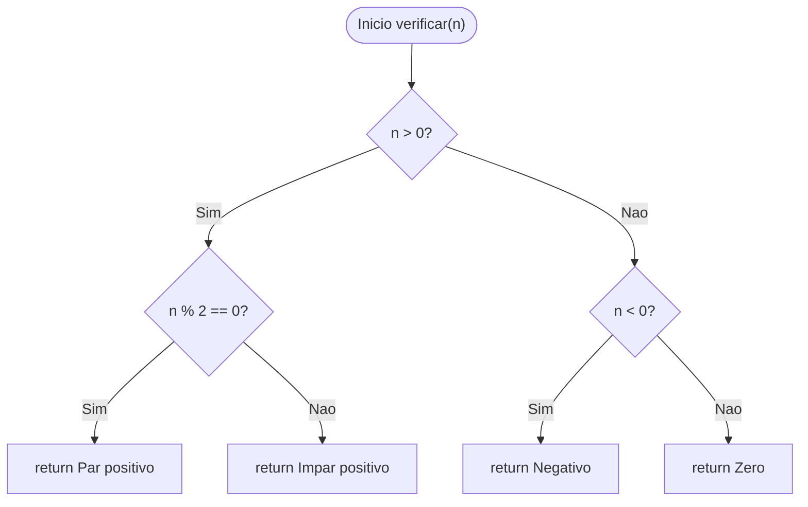
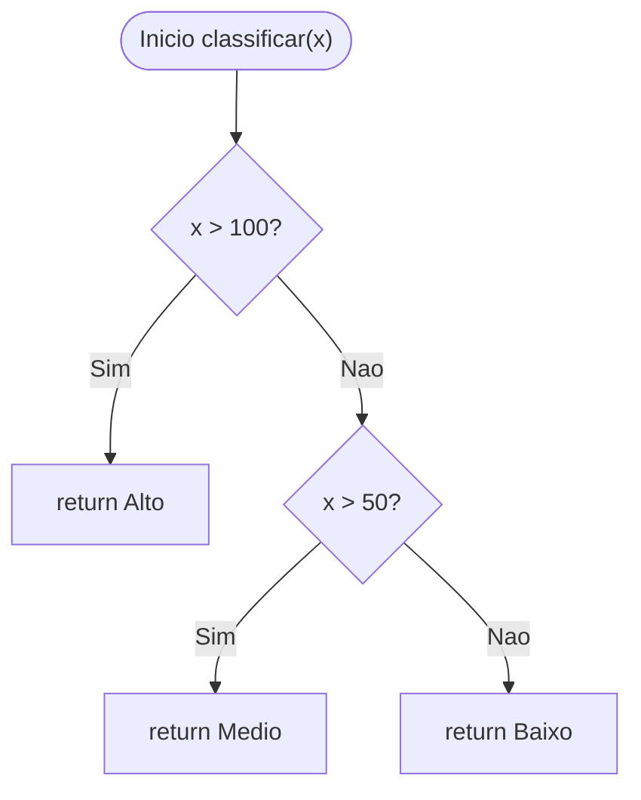
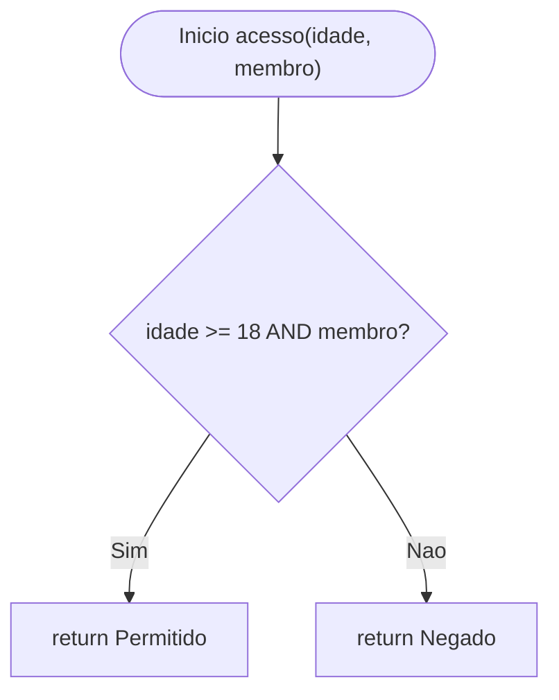
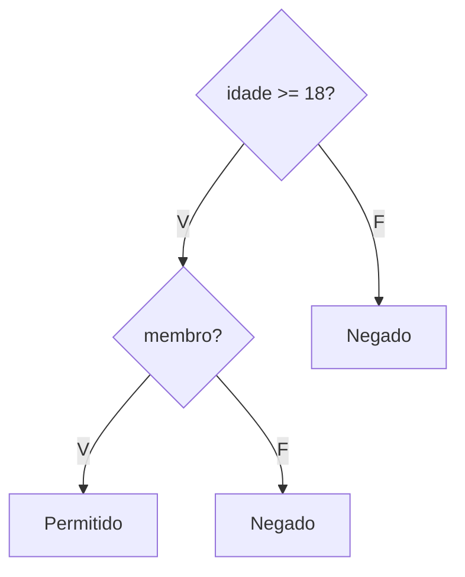
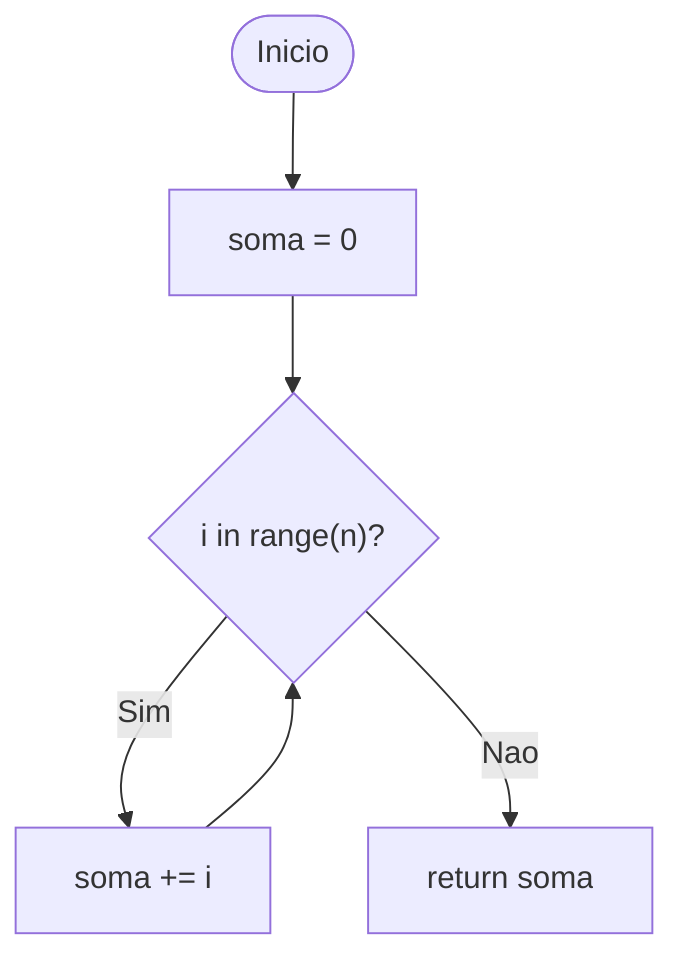
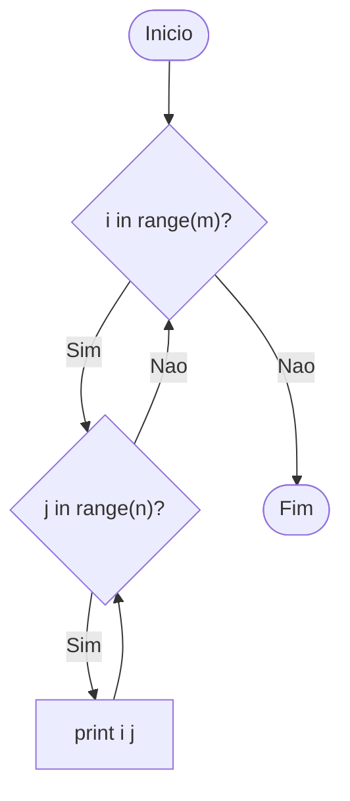
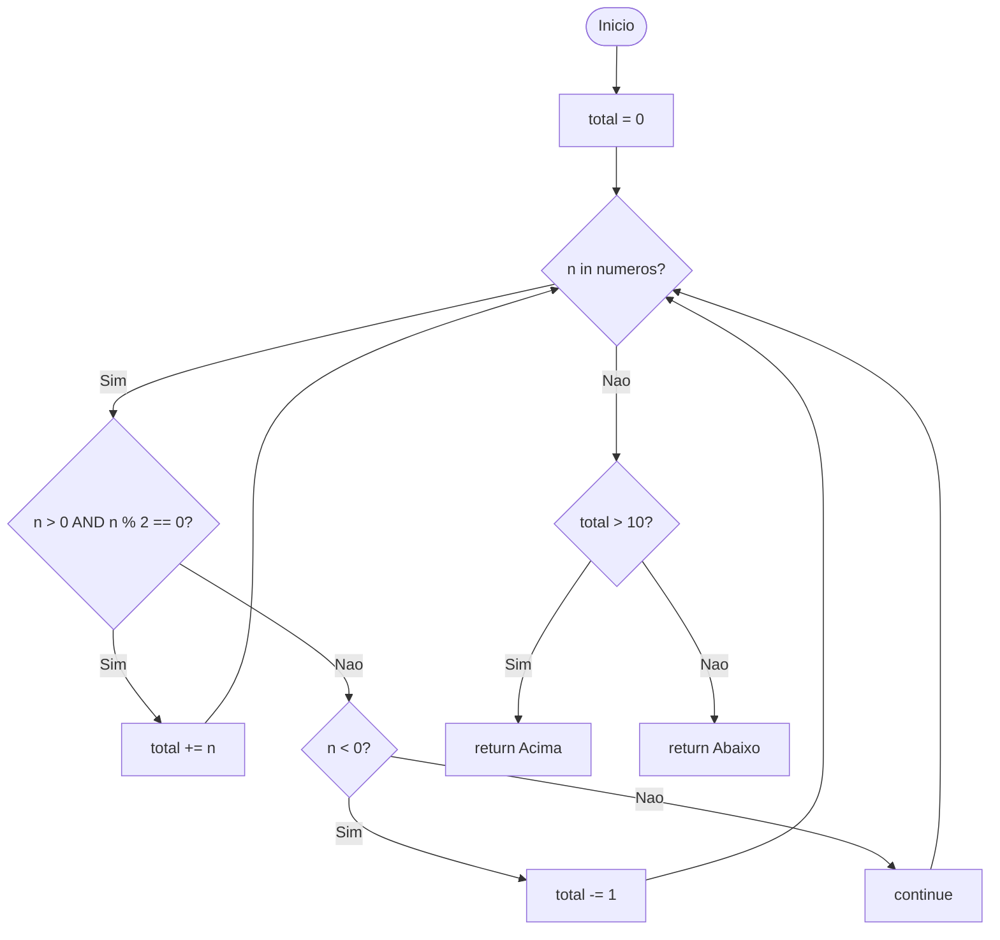
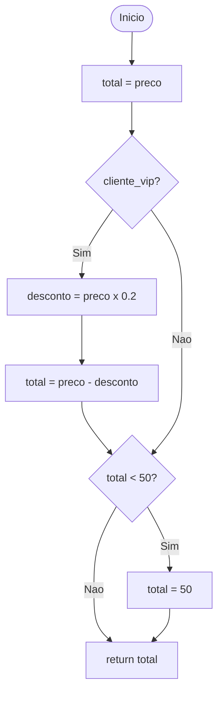
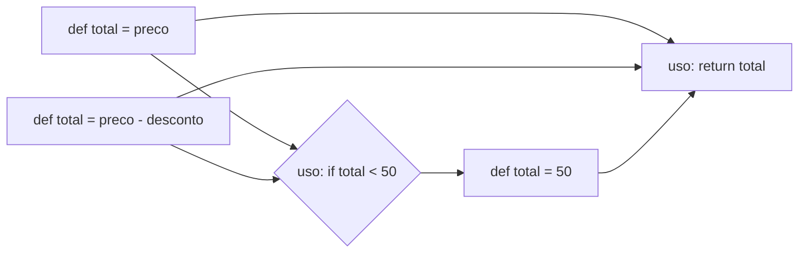

# Exercício 1 — Caminhos Independentes

## 1.1 Grafo de Fluxo de Controle (GFC)



---

## 1.2 Complexidade Ciclomática

```
V(G) = E − N + 2
E = 10 arestas
N = 8 nos
V(G) = 10 − 8 + 2 = 4
```

---

## 1.3 Caminhos Independentes

| Caminho | Sequência de Nós   | Condição      | Entrada |
|---------|--------------------|---------------|---------|
| C1      | N1→N2(F)→N6(F)→N8 | n == 0        | 0       |
| C2      | N1→N2(F)→N6(V)→N7 | n < 0         | -1      |
| C3      | N1→N2(V)→N3(V)→N4 | n > 0 e par   | 4       |
| C4      | N1→N2(V)→N3(F)→N5 | n > 0 e impar | 3       |

---

## 1.4 Casos de Teste

| CT  | Entrada | Saída Esperada   | Caminho |
|-----|---------|------------------|---------|
| CT1 | n=4     | "Par positivo"   | C3      |
| CT2 | n=3     | "Impar positivo" | C4      |
| CT3 | n=-1    | "Negativo"       | C2      |
| CT4 | n=0     | "Zero"           | C1      |

---

# Exercício 2 — Cobertura de Comandos e Ramos

## 2.1 Grafo de Fluxo de Controle (GFC)



---

## 2.2 Complexidade Ciclomática

```
V(G) = E − N + 2
E = 7 arestas
N = 6 nos
V(G) = 7 − 6 + 2 = 3
```

---

## 2.3 Caminhos Independentes

| #  | Caminho            | Condição      |
|----|--------------------|---------------|
| C1 | N1→N2(S)→N3        | x > 100       |
| C2 | N1→N2(N)→N4(S)→N5  | 50 < x ≤ 100  |
| C3 | N1→N2(N)→N4(N)→N6  | x ≤ 50        |

---

## 2.4 Cobertura de Comandos (C0)

| CT  | x   | Retorno | Linha coberta    |
|-----|-----|---------|------------------|
| CT1 | 150 | Alto    | `return "Alto"`  |
| CT2 | 75  | Medio   | `return "Medio"` |
| CT3 | 30  | Baixo   | `return "Baixo"` |

São necessários **3 CTs** para executar todos os comandos (`return`) distintos.

---

## 2.5 Cobertura de Ramos (C1)

Os **mesmos 3 casos de teste** cobrem todos os ramos (Sim/Não de cada `if`):

| Ramo          | CT que cobre |
|---------------|--------------|
| x > 100 = Sim | CT1          |
| x > 100 = Não | CT2 ou CT3   |
| x > 50 = Sim  | CT2          |
| x > 50 = Não  | CT3          |

Conclusão:

```
C0 = C1 = 3 testes
```

---

# Exercício 3 — Cobertura de Condição

## 3.1 Grafo de Fluxo de Controle (GFC)



---

## 3.2 Árvore de Condições (subcondições)



---

## 3.3 Complexidade Ciclomática

```
V(G) = n de predicados + 1 = 1 + 1 = 2
```

---

## 3.4 Cobertura de Condição (CC) vs Cobertura de Ramos (C1)

| CT  | idade | membro | idade >= 18 | membro (bool) | Resultado | C1 | CC |
|-----|-------|--------|-------------|---------------|-----------|----|----|
| CT1 | 20    | True   | True        | True          | Permitido | ✓  | ✓  |
| CT2 | 20    | False  | True        | False         | Negado    |    | ✓  |
| CT3 | 16    | True   | False       | True          | Negado    |    | ✓  |
| CT4 | 16    | False  | False       | False         | Negado    | ✓  | ✓  |

- **C1 (Ramos):** 2 CTs necessários — cobre apenas Sim/Não do `if` composto.
- **CC (Condição):** 4 CTs necessários — cobre todas as combinações de cada subcondição individualmente.
- **Diferença:** CC é mais rigorosa. Com apenas C1, o comportamento individual de `idade >= 18` e `membro` pode não ser totalmente exercitado.

## 3.5 Casos de Teste de Ramos (C1)

| CT  | idade | membro | Resultado | Ramo         |
|-----|-------|--------|-----------|--------------|
| CT5 | 18    | True   | Permitido | ramo Sim     |
| CT6 | 17    | True   | Negado    | ramo Não     |

---

# Exercício 4 — Teste de Ciclo

## 4.1 Grafo de Fluxo de Controle (GFC)



---

## 4.2 Complexidade Ciclomática

```
V(G) = n de predicados + 1 = 1 + 1 = 2
```

---

## 4.3 Casos de Teste

| CT  | n | Iterações | Resultado | Cenário                       |
|-----|---|-----------|-----------|-------------------------------|
| CT1 | 0 | 0         | 0         | Laço ignorado (0 iterações)   |
| CT2 | 1 | 1         | 0         | Laço executado 1 vez          |
| CT3 | 5 | 5         | 10        | Laço várias vezes (0+1+2+3+4) |
| CT4 | 2 | 2         | 1         | Laço duas vezes (0+1=1)       |

---

# Exercício 5 — Ciclos Aninhados

## 5.1 Grafo de Fluxo de Controle (GFC)



---

## 5.2 Complexidade Ciclomática

```
V(G) = n de predicados + 1 = 2 + 1 = 3
```

---

## 5.3 Casos de Teste

| CT  | m | n | Execuções de print | Cenário                     |
|-----|---|---|--------------------|-----------------------------|
| CT1 | 0 | 0 | 0                  | Ambos os laços ignorados    |
| CT2 | 1 | 0 | 0                  | Laço j ignorado             |
| CT3 | 1 | 3 | 3                  | i executa 1 vez, j 3 vezes  |
| CT4 | 3 | 3 | 9                  | Ambos executam várias vezes |
| CT5 | 3 | 1 | 3                  | i executa 3 vezes, j 1 vez  |

Propriedade:

```
prints = m x n
```

---

# Exercício 6 — Teste Integrado

## 6.1 Grafo de Fluxo de Controle (GFC)



---

## 6.2 Complexidade Ciclomática

```
V(G) = n de predicados + 1
Predicados: laco, (n > 0 AND n % 2 == 0), (n < 0), (total > 10)
V(G) = 5
```

---

## 6.3 Casos de Teste

| CT  | numeros   | total | Retorno | Critério                     |
|-----|-----------|-------|---------|------------------------------|
| CT1 | []        | 0     | Abaixo  | Laço 0 iterações             |
| CT2 | [2]       | 2     | Abaixo  | 1 iteração, n par positivo   |
| CT3 | [2, 4, 6] | 12    | Acima   | Várias iterações, total > 10 |
| CT4 | [-1]      | -1    | Abaixo  | n negativo, total -= 1       |
| CT5 | [1]       | 0     | Abaixo  | n ímpar positivo → continue  |

---

## 6.4 Pares Def-Uso de `total`

| Definição    | Uso          | Quando                        |
|--------------|--------------|-------------------------------|
| `total = 0`  | `total += n` | sempre (entra no loop)        |
| `total = 0`  | `total -= 1` | sempre (entra no loop)        |
| `total = 0`  | `total > 10` | após o loop                   |
| `total += n` | `total > 10` | após acumular pares positivos |
| `total -= 1` | `total > 10` | após decrementar              |

---

# Exercício 7 — Fluxo de Dados

## 7.1 Grafo de Fluxo de Controle (GFC)



---

## 7.2 Fluxo de Dados — Def-Use de `total`



---

## 7.3 Definições e Usos de Variáveis

| Variável      | Definição (linha) | Usos (linhas) |
|---------------|-------------------|---------------|
| `preco`       | L1 (parâmetro)    | L2, L4, L5    |
| `cliente_vip` | L1 (parâmetro)    | L3            |
| `total`       | L2, L5, L7        | L6, L8        |
| `desconto`    | L4                | L5            |

---

## 7.4 Pares Def-Uso de `total`

| Par      | Definição            | Uso             | Condição                        |
|----------|----------------------|-----------------|---------------------------------|
| (L2, L6) | `total = preco`      | `if total < 50` | sempre                          |
| (L2, L8) | `total = preco`      | `return total`  | cliente_vip=False e total >= 50 |
| (L5, L6) | `total = preco-desc` | `if total < 50` | cliente_vip=True                |
| (L5, L8) | `total = preco-desc` | `return total`  | cliente_vip=True e total >= 50  |
| (L7, L8) | `total = 50`         | `return total`  | total original < 50             |

---

## 7.5 Casos de Teste (All-Defs e All-Uses)

| CT  | preco | cliente_vip | Saída | Critério                                   |
|-----|-------|-------------|-------|--------------------------------------------|
| CT1 | 100   | False       | 100   | All-Defs: def L2; cobre (L2,L6) e (L2,L8) |
| CT2 | 30    | False       | 50    | All-Defs: def L7; cobre (L2,L6) e (L7,L8) |
| CT3 | 100   | True        | 80    | All-Defs: def L5; cobre (L5,L6) e (L5,L8) |
| CT4 | 30    | True        | 50    | All-Uses: cobre (L5,L6) e (L7,L8)         |
| CT5 | 50    | False       | 50    | Valor limite: total == 50                  |
| CT6 | 60    | True        | 50    | total = 48 < 50 com vip                    |

---

## 7.6 Par def-uso não coberto por C1

O par **(L5, L8)** — `cliente_vip=True` e `total >= 50` — pode não ser coberto pelos testes de C1, que verificam apenas o True/False de cada `if` isoladamente.
É necessário incluir explicitamente o **CT3** (`preco=100, cliente_vip=True`) para garantir a cobertura desse par.
